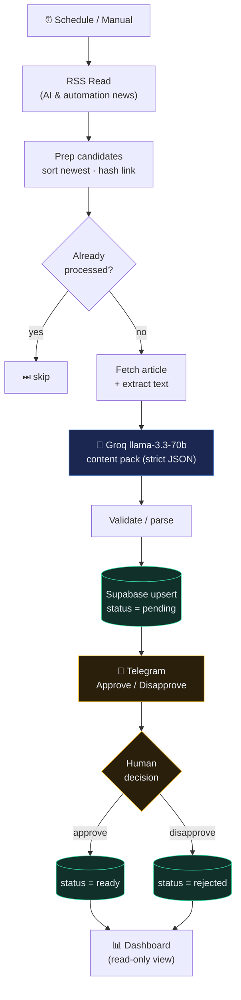

<h1 align="center">AI Content Engine</h1>

  <em>Autonomous content repurposing with a human-in-the-loop approval gate.</em> 
  AI/automation news in → on-brand LinkedIn post + X thread + newsletter blurb out →
  one Telegram tap to approve.

  
  
  
  

<!-- Demo GIF slot — add once recorded: assets/demo.gif -->

---

## What it does

A scheduled n8n workflow reads AI/automation news. For the newest **unprocessed** article it
fetches the page, grounds an LLM on the real text, and generates a **content pack** — a
LinkedIn post, a 5–7 post X/Twitter thread, and a newsletter blurb — in a consistent brand
voice. The pack is upserted as `pending` and pushed to **Telegram with Approve / Disapprove
buttons**. The execution **pauses** until a human taps a button; Approve flips the row to
`ready`, Disapprove to `rejected`. A public dashboard shows every pack and its status.

**Why this design:** it demonstrates *controlled* autonomy — scheduled generation that never
marks anything publish-ready without an explicit human decision. A deliberately different
class of system from a fully-autonomous pipeline.

## Architecture

**Idempotency:** each article is keyed by a stable hash of its URL. A dedup check skips
already-processed articles *before* spending an LLM call, and the insert is an upsert on that
key — so re-runs never duplicate. The pipeline naturally advances to the next fresh article
each run: one approvable pack at a time.

## Stack (100% free, no card)

| Concern        | Tool                                |
|----------------|-------------------------------------|
| Orchestration  | n8n Cloud                           |
| LLM            | Groq · `llama-3.3-70b-versatile`    |
| Database       | Supabase (Postgres + RLS)           |
| Approval / alerts | Telegram bot (inline keyboards)  |
| Dashboard host | GitHub Pages (Actions deploy)       |

## Engineering decisions & what I learned

- **Human-in-the-loop via the native `Send and Wait` node.** I used n8n's built-in Telegram
  `sendAndWait` (approval mode) instead of hand-rolling `sendMessage` + a separate callback
  trigger workflow. One node, n8n auto-provisions the single-use resume webhook, and the
  execution genuinely pauses until a human responds — far less to get wrong, and the
  single-use URL makes the approval idempotent (a re-tap can't double-apply).
- **Idempotency on a source-URL hash.** A `content_exists` RPC (returns exactly one row) gates
  generation, and the insert is an upsert on `dedup_key`. n8n drops a branch when an HTTP node
  returns an empty `[]`, so the always-one-row RPC keeps the dedup `IF`/`Filter` reliable.
- **Grounding beats the feed.** The source feed only carries headlines + a one-line summary,
  so I fetch the article page and extract `
` paragraphs (filtering short nav text), with a
  fallback to the RSS summary if the fetch is thin. The prompt instructs the model to use only
  the supplied text — no fabricated stats or quotes.
- **Deterministic structure, creative copy.** Temperature is moderate for voice, but the
  *shape* (required keys, thread length, char limits) is enforced by a JSON validator after the
  model — malformed output fails loudly instead of flowing downstream.
- **Sanitized public view for safe anon reads.** The dashboard reads a `content_public` view
  with the anon key; RLS blocks the raw table, and the view hides copy for rejected packs.
  The service role (n8n only) is never exposed to the browser.
- **Deliberate scope boundary.** Auto-posting to LinkedIn/X is intentionally out of scope —
  those APIs need app review / paid tiers, and this is a 100%-free build. "Ready" = approved &
  queued; the dashboard is the deliverable surface.

## Live demo

- **Content dashboard:** https://karl22puday-eng.github.io/ai-content-engine/ &nbsp;(read-only, sanitized view)

## Status

✅ Working end to end: RSS → AI content pack → Telegram approval → status flip → live dashboard.
See [`docs/BUILD_GUIDE.md`](docs/BUILD_GUIDE.md) for the build order and engineering notes, and
[`workflows/`](workflows/) for the exported n8n workflow (reproducible via
[`scripts/build-generator-workflow.ps1`](scripts/build-generator-workflow.ps1)).

---

> Companion to my [AI Lead Qualification & CRM Automation System](https://github.com/karl22puday-eng/ai-lead-qualification-system).
